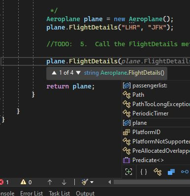

# C# Constructors & Overloading

## Learning Objectives
- Understand class instantiation
- Understand constructors
- Understand what overloading means

## Set up instructions
- Fork this repository and clone the forked version to your machine
- Open the solution file in Visual Studio.
- Complete items on the Task List goto View then Task List.
- Run the tests that are in the Test Explorer.

## Tips  

In Visual Studio, when you start typing your calls you can see details of the overloading.
